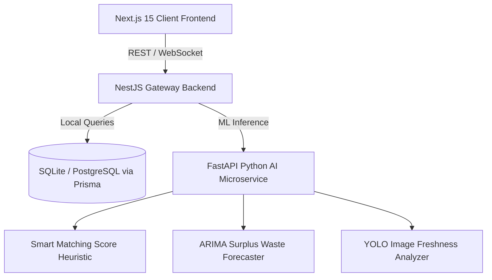

# FoodBridge AI 🚀
### Connecting Surplus Food to People Who Need It

FoodBridge AI is an enterprise-grade, AI-powered food redistribution SaaS monorepo designed to eliminate commercial food waste and optimize social aid logistics. The platform leverages predictive forecasting, automated donor-NGO matchmaking heuristics, real-time route tracing, and carbon offset reporting.

---

## 🛠️ Technology Stack & Architecture

The project is structured as a **workspace monorepo** consisting of three primary layers:



- **Frontend (`apps/frontend`):** Next.js 15, React 19, Tailwind CSS, Framer Motion, Recharts, and Leaflet Maps.
- **Backend (`apps/backend`):** NestJS framework, Prisma ORM, Websockets, REST controllers.
- **AI Service (`apps/ai-service`):** FastAPI Python server, scikit-learn models, heuristic matching & computer vision simulation.

---

## 🚀 Setup & Execution Guide

### Prerequisite Check
Ensure you have **Node.js 18+** and **npm** installed on your system. Python 3.10+ is optional (fallback simulation logic runs if the Python AI service is unreachable).

### Step 1: Install Dependencies
From the root workspace directory, run:
```bash
npm install
```

### Step 2: Initialize Database and Schema
Generate the local SQLite database client, run database push, and populate it with seed metrics:
```bash
npm run prisma:generate
npm run prisma:db:push
npm run prisma:seed
```

### Step 3: Spin Up Development Servers

#### Option A: Run Services Concurrently (Frontend + Backend)
To launch both the NestJS API gateway (port `4000`) and the Next.js client portal (port `3000`) together:
```bash
npm run dev
```

#### Option B: Spin Up Python AI microservice (Optional)
If Python is configured on your machine, navigate to the service folder, install dependencies, and boot:
```bash
cd apps/ai-service
pip install -r requirements.txt
uvicorn main:app --reload --port 8000
```
*Note: If the AI microservice is not running, the platform's matching and vision processes will gracefully transition to built-in fallback simulation algorithms, remaining 100% functional.*

---

## 🐋 Production Deployment (Docker Compose)

To spin up all services together in optimized Docker containers:
```bash
docker-compose up --build
```
This maps:
- Frontend Client Portal: `http://localhost:3000`
- Backend API Endpoint: `http://localhost:4000`
- FastAPI AI Microservice: `http://localhost:8000`

---

## 📝 API Endpoint Directory

### 🧠 FastAPI AI Services (Port `8000`)
- **`POST /api/v1/predict-surplus`**: Estimates waste risk indicators based on historical moving sales, weather indices, and upcoming community events.
- **`POST /api/v1/smart-matching`**: Runs a multi-criteria optimization matrix evaluating distance, shelf-life, and capacity constraint metrics.
- **`POST /api/v1/computer-vision`**: Simulates YOLO analysis on food images to calculate freshness percentages, safety recommendations, and packaging integrity.
- **`POST /api/v1/chat`**: Conversational RAG assistant answering food safety storage rules.

### 🌐 NestJS API Server (Port `4000`)
- **`POST /auth/login`**: Simulates JWT credentials lookup.
- **`POST /donations`**: Submits a surplus food lot, triggering AI vision audits.
- **`POST /donations/:id/match`**: Generates ranked nearby NGO matches using local routing algorithms.
- **`POST /logistics/deliveries`**: Schedules courier assignment.
- **`POST /logistics/deliveries/:id/verify`**: Confirms hand-off using the QR code (inputs: `QR_MATCHED`).

---

## 🧪 Verification Diagnostics

To run programmatic integration diagnostics verifying database sanity and entity relations:
```bash
npm --prefix apps/backend run ts-node test-verify.ts
```
Expected output:
```text
--- STARTING PLATFORM DIAGNOSTICS ---
1. Checking database connection...
   [SUCCESS] Connected to SQLite database.
2. Auditing organization entities...
   [SUCCESS] Found 4 registered organizations.
3. Validating user configuration models...
   [SUCCESS] Found 4 active platform profiles.
4. Performing integrity check on donation ledger...
   [SUCCESS] 3 total food batches logged.
--- ALL SYSTEMS INTEGRATIONAL HEALTH CHECKS PASSED ---
```
